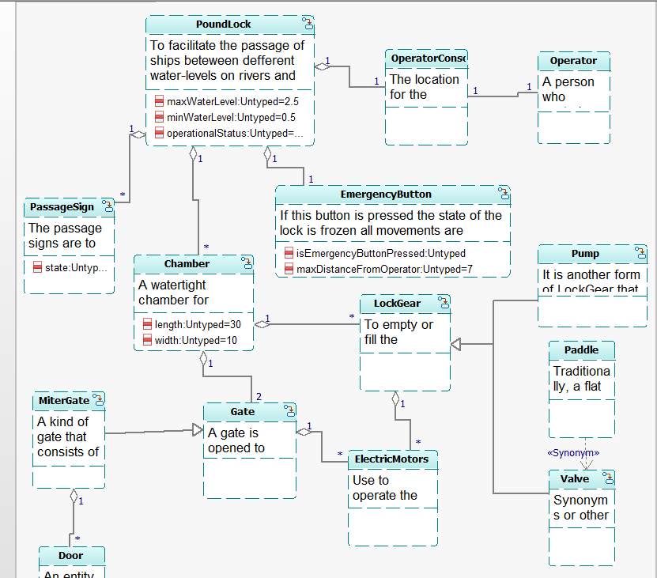
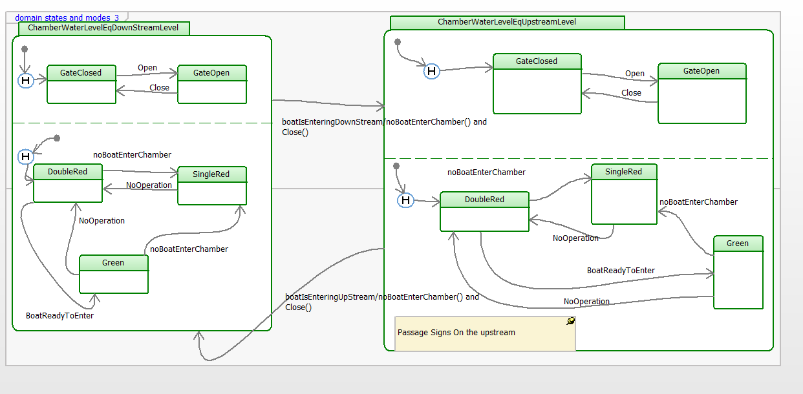

# Tuevaart Pound Lock System

## Overview

The Tuevaart Pound Lock System is designed to facilitate the safe and efficient passage of vessels through varying water levels in the Tuevaart canal at Waterhoven. This document outlines the stakeholder requirements and general operation of the pound lock system, including its modeling using Rhapsody.

## Purpose 

The purpose of this project is to demonstrate how system engineers can conduct domain modeling and analysis to refine requirements using the Rhapsody tool. This process involves collaboration with stakeholders for domain-driven development and is based on insights gained from a workshop on domain modeling conducted at TU/e.

## General Description

A pound lock is a device used for raising and lowering boats between stretches of water of different levels in river and canal waterways. It features a fixed chamber where water levels can be varied, allowing for the navigation of vessels across different elevations.

### Key Elements of a Pound Lock

1. **Watertight Chamber**: A fixed chamber that connects the upper and lower canals, designed to accommodate one or more boats.
2. **Gates**: Located at each end of the chamber, these miter gates control water levels and allow boats to enter and exit the chamber.
3. **Lock Gear**: A system of valves (traditionally paddles) or pumps to fill or empty the chamber as needed.

### Operation Principle

When a boat is traveling downstream and encounters a full lock:
- Open the upper paddles to match the upstream water level.
- Open the upstream gate; passage signs turn green.
- Boats enter the chamber; signs revert to red, and gates are closed.
- Open the lower paddles to lower the boat by draining the chamber.
- Open the exit gate for the boat to leave.

The reverse process occurs for boats traveling upstream.

## Stakeholder Requirements

1. **Pound Lock Design**: The system must operate as a pound lock to facilitate vessel passage in the Tuevaart.
2. **Chamber Dimensions**: The chamber must be 30 meters long and 10 meters wide.
3. **Water Level Variation**: It must accommodate a water level difference of 50 cm to 2.5 m, depending on seasonal and weather conditions.
4. **Boat Draught Capacity**: The system must service boats with a maximum draught of 2 meters.
5. **Gate Type**: The lock shall utilize miter gates.
6. **Electric Operation**: Gates and valves are to be operated by electric motors.
7. **Gate Operation Control**: Both gates cannot be opened simultaneously.
8. **Operator Control**: The lock is controlled from an operator console located on the quay.
9. **Emergency Accessibility**: An emergency button must be accessible within 7 meters at each lock location.
10. **Emergency Protocol**: Pressing the emergency button will freeze all operations until the release button is pressed.
11. **Maintenance Mode**: The lock system can switch to maintenance mode, allowing independent operation of all components.
12. **Passage Signs**: Signs will indicate three states:
    - Double Red: No operation
    - Single Red: Boats may not enter
    - Green: Boats may enter
13. **Cycle Time**: The maximum duration for a single passage cycle is 16 minutes.
14. **Rhapsody Modeling**: The system requirements and architecture will be modeled using Rhapsody.
15. **System Modeling Profile**: Adherence to a system modeling profile to ensure consistency and clarity in system design and documentation.

# Results

## Domain Model

## State Diagram for Chamber

## Glossary
